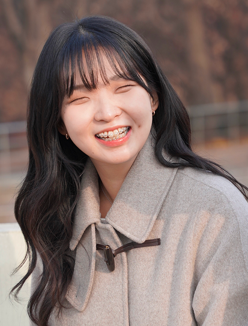

>  2025 구름톤유니브 시즌톤🍁 68팀 언프레임의 FE 레포지토리입니다.

[1min BE/AI 레포지토리 바로가기](https://github.com/9oormthon-univ/2025_SEASONTHON_TEAM_68_BE)

# 😎하나의 회의록에서 최고의 생산성을, 1min!😎

1min은 회의에서 도출된 Action Item을 기반으로 **회의의 생산성을 진단**하고,  
**우선순위에 따른 할 일 관리**를 통해 신속하게 업무를 시작하도록 돕는 정보 과잉 해결 솔루션입니다.

  

## 🔥 This is Our Team

| PM | Design | Frontend | Backend |
|:--:|:------:|:--------:|:-------:|
|  |  |  |  |
| 성균관대학교 4기 | 고려대학교 4기 | 성균관대학교 3기 | 상명대학교(천안) 4기 |
| 이채연 | 박정윤 | 이송목 | 이채주 |
| [@i-chaeyeon](https://github.com/i-chaeyeon) | - | [@fine-pine](https://github.com/fine-pine) | [@skxcv312](https://github.com/skxcv312) |

## 🛠️ Tech Stacks
    

----
## 😎 서비스 소개

## 😎 기능 소개

## 🛠️ Service Architecture

